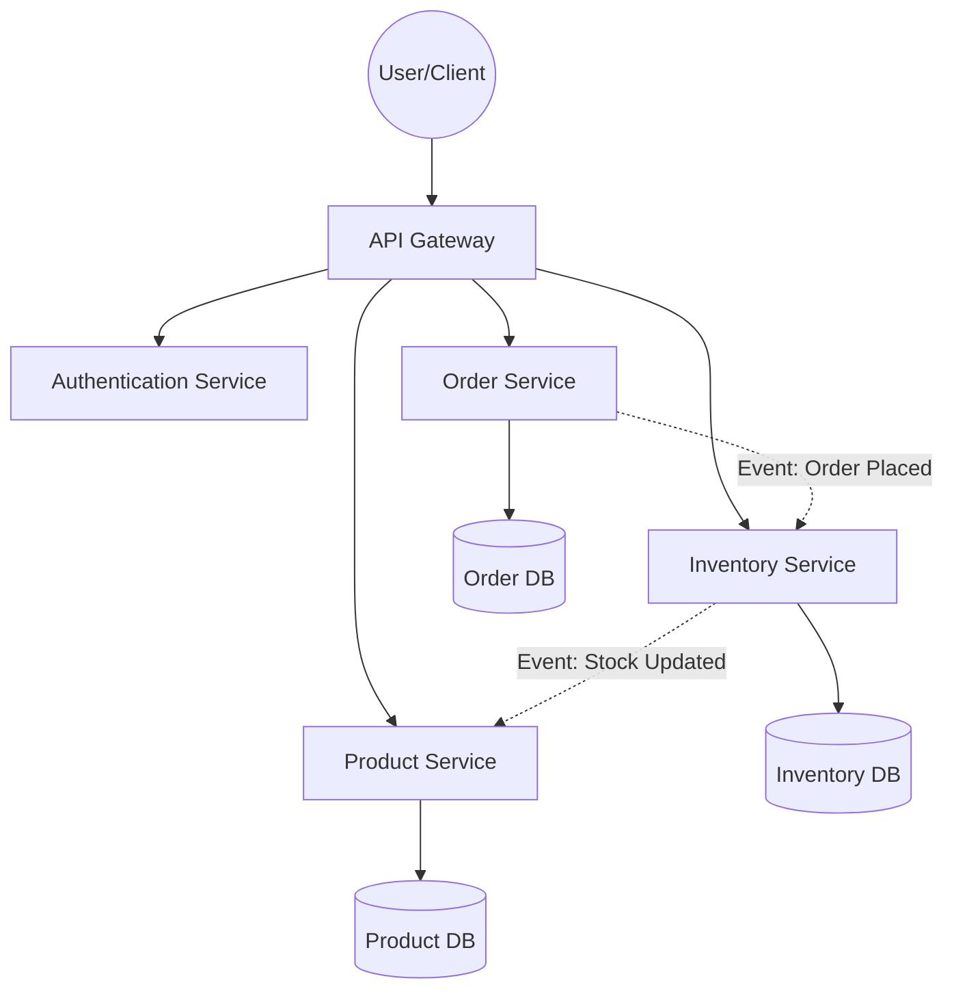

<!-- Updated by Software Architect Agent | 2026-04-21 03:13 -->

# Inventory Management System Architecture

## Overview
This document provides a high-level architectural overview of the Inventory Management System (IMS). The system is designed to manage stock levels, track product movements, handle orders, and provide real-time visibility into warehouse operations.

## System Architecture
The system follows a microservices architecture to ensure scalability, maintainability, and independent deployment of core functionalities.

## Core Components

### 1. API Gateway
Acts as the single entry point for all client requests. It handles:
- Request routing
- Rate limiting
- SSL termination
- Authentication/Authorization checks

### 2. Authentication Service
Manages user identities, roles, and permissions. It issues JWT (JSON Web Tokens) for secure communication between services.

### 3. Product Service
Manages the product catalog, including:
- Product metadata (name, description, category, SKU)
- Pricing information
- Attribute management (size, color, etc.)

### 4. Inventory Service
The core engine for stock management:
- Real-time stock level tracking
- Warehouse location management
- Stock adjustment (manual and automated)
- Low-stock alerts

### 5. Order Service
Handles the lifecycle of an order:
- Order creation and validation
- Order status tracking (Pending, Paid, Shipped, Delivered, Cancelled)
- Integration with payment gateways

## Data Management Strategy
Each microservice owns its own database to ensure loose coupling and prevent "distributed monolith" anti-patterns.

- **Product DB**: Relational database (e.g., PostgreSQL) for complex product relationships.
- **Inventory DB**: High-performance database (e.g., Redis for real-time, PostgreSQL for persistence) to handle high-frequency updates.
- **Order DB**: Relational database (e.g., PostgreSQL) to ensure ACID compliance for financial transactions.

## Scalability and Reliability
- **Horizontal Scaling**: Each service can be scaled independently based on demand.
- **Event-Driven Communication**: Uses a message broker (e.g., RabbitMQ or Kafka) to handle asynchronous communication between services, ensuring eventual consistency and decoupling.
- **Caching**: Distributed cache (e.g., Redis) is used to reduce database load for frequently accessed data like product details.

## Security Considerations
- **Zero Trust Architecture**: Every service must validate the JWT provided by the API Gateway.
- **Data Encryption**: All sensitive data is encrypted at rest (AES-256) and in transit (TLS 1.2+).
- **Principle of Least Privilege**: Services only have access to the specific data and resources required for their function.
