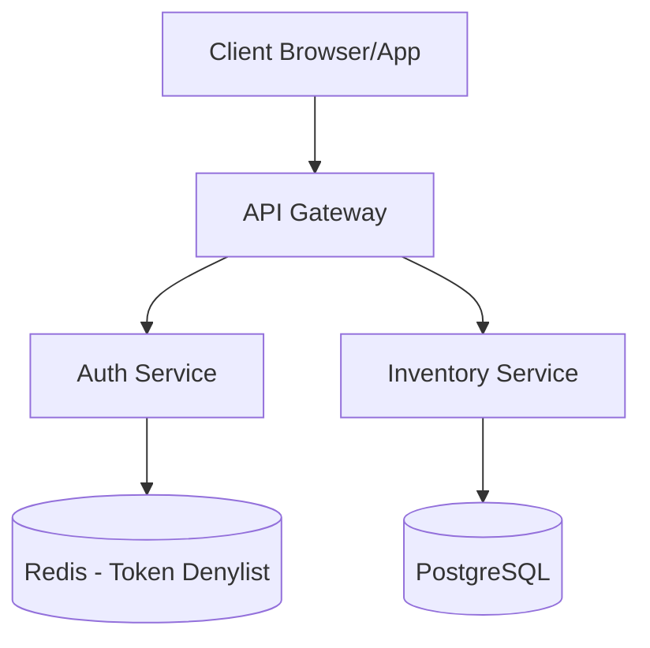
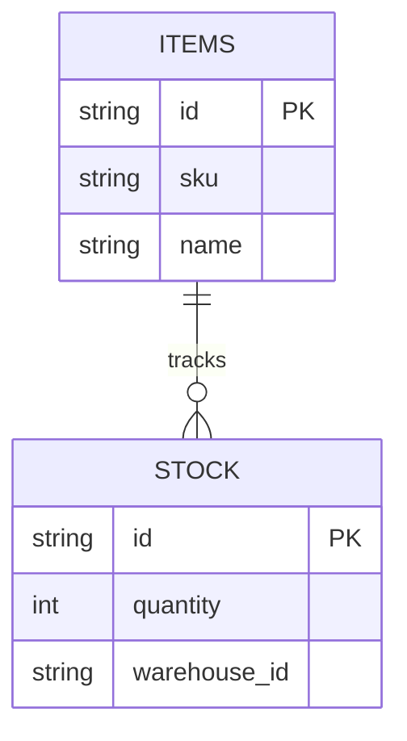

<!-- Generated by Software Architect Agent | 2026-04-18 13:47 -->

# Inventory Management System Architecture

## Overview
A scalable, microservices-based architecture for managing enterprise inventory, ensuring real-time stock tracking and high availability.

## Authentication & Security
The system uses JWT-based authentication to manage secure access.

### JWT Strategy
- **Access Tokens:** Short-lived (15 minutes). Used for API authorization.
- **Refresh Tokens:** Long-lived (7 days). Stored in `HttpOnly` cookies. Used to rotate Access Tokens.
- **Refresh Token Rotation:** Each refresh request issues a new refresh token and invalidates the previous one to prevent replay attacks.
- **Public Access:** The inventory read-only endpoints are exposed via an API Gateway with rate limiting. Write operations require valid JWTs with `ROLE_ADMIN` or `ROLE_EDITOR`.

### Security Considerations
- All traffic must be encrypted via TLS 1.3.
- Sensitive environment variables (database credentials, JWT secrets) are managed via HashiCorp Vault.
- API requests are throttled at the Gateway level to prevent DDoS.

## System Components

## Data Schema

